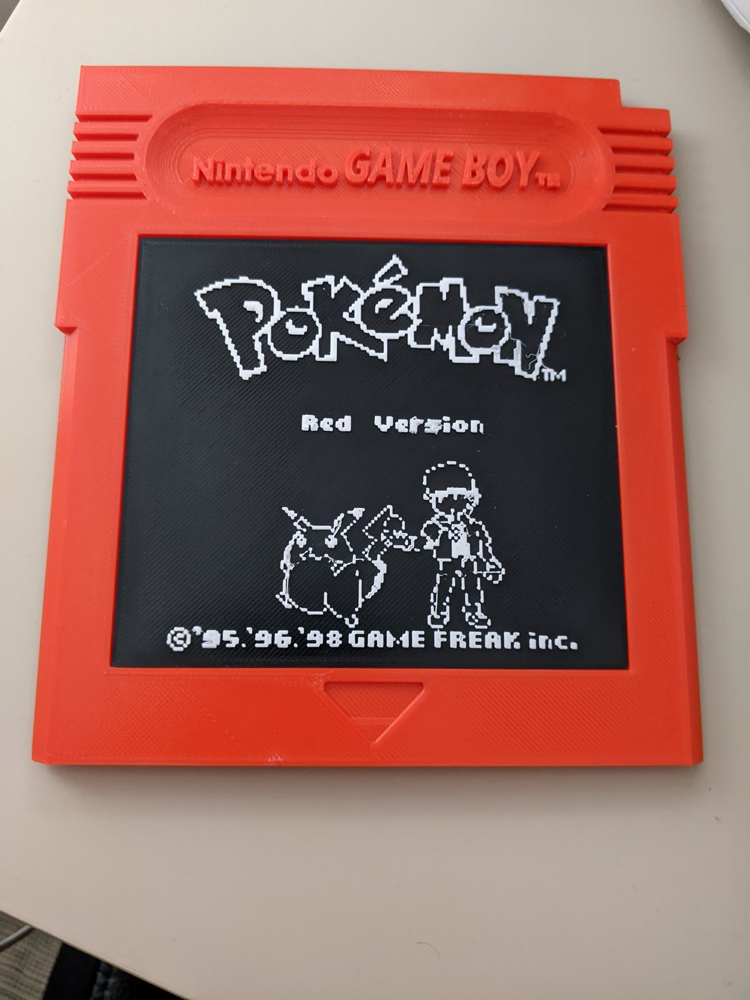

# Pixel-Art-Extruder
This project is for creating extruded pixel art.

## Description

This script takes in an image and outputs two stl files, the first is each of the pixels extruded and the second
is a backplate to print them on

Some example projects can be found in /prints. These can be loaded up in Cura.



## Getting Started

This project requires Python 3 and the libraries in requirement.txt

### Installing Required Libraries

```
    pip install -r requirements.txt
```

### Executing program
```
    python3 main.py [input image]
```
This should output two files, pixels.stl and backplate.stl

## Acknowledgments

Original Gameboy cart stl
* [Angrypencil](https://www.thingiverse.com/angrypencil/designs)